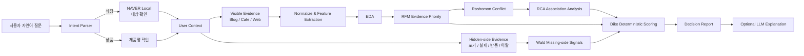

# ⚖️ Dike's Eye

> **평균 리뷰가 아니라, 내 조건에서의 선택을 돕는 Evidence 기반 Decision Agent**

**Live App:** https://dikes-eye-poc.streamlit.app/

리뷰 서비스는 보통 “사람들이 얼마나 좋아했는가”를 보여줍니다.  
하지만 실제 결정에서 더 중요한 질문은 다릅니다.

- 토요일 저녁 소개팅인데 **이 식당이 나에게 괜찮은가?**
- 출퇴근용으로 쓰려는데 **이 제품의 단점이 내 사용조건에서 문제가 되는가?**
- 별점은 높은데 왜 어떤 사람은 강하게 싫어하는가?
- 애초에 방문하지 못했거나, 반품하고 떠난 사람의 경험은 어디에 있는가?

Dike's Eye는 리뷰를 단순 요약하지 않습니다.  
**의견이 갈리는 이유(Rashomon)**와 **리뷰에 잘 남지 않는 이탈 신호(Wald)**를 함께 보고, 사용자의 상황과 맞는 Evidence에 더 높은 가중치를 주어 **조건 적합도와 판단 근거**를 제공합니다.

---

## 1. 핵심 가치

### 🎭 Rashomon — 서로 다른 진실

같은 식당이나 제품인데도 평가는 갈립니다.

- 평일에는 조용하지만 주말 저녁에는 시끄럽다.
- 일반 사용에서는 만족도가 높지만 장시간 사용에서는 발열이 문제다.
- 누군가는 좋은 가성비라고 느끼지만 다른 사람에게는 핵심 기능이 부족하다.

Dike's Eye는 단순 평균 대신 **어떤 조건에서 평가가 갈리는지**를 찾습니다.

### 🕳️ Wald — 사라진 진실

리뷰에는 선택편향이 존재합니다.

- 예약에 실패한 사람은 방문 리뷰를 남기지 못할 수 있습니다.
- 긴 웨이팅을 포기한 사람은 음식 리뷰에 포함되지 않을 수 있습니다.
- 제품을 반품·환불하거나 중고로 처분한 사용자는 만족 후기 집단과 다른 행동을 보일 수 있습니다.

Dike's Eye는 이런 **선택 이전/이탈 Evidence를 별도 검색**합니다.  
단, 이를 실제 실패율·반품률로 해석하지 않고 **놓치기 쉬운 위험 신호**로만 사용합니다.

### ⚖️ Dike — 공정한 판단

최종적으로 사용자의 목적·시간·선호 조건과 Evidence를 결합해 판단합니다.

> **“많이 좋아하는가?”가 아니라 “내가 선택해도 되는가?”**

---

## 2. 실제 사용 예시

### 식당

```text
토요일 7시 소개팅인데 성수 어니언 어때?
```

Dike's Eye가 자동으로 해석합니다.

```text
대상      : 성수 어니언
요일      : 토요일
시간      : 19:00
목적      : 소개팅
중요 조건 : 분위기 / 대화 / 예약 / 웨이팅
```

### 상품

```text
출퇴근용으로 소니 WH-1000XM6 사도 될까? 배터리랑 착용감이 중요해
```

```text
대상      : 소니 WH-1000XM6
목적      : 출퇴근
중요 조건 : 배터리 / 착용감
```

사용자는 복잡한 분석 과정을 볼 필요 없이 다음만 먼저 확인합니다.

```text
🟡 조건부 추천 · 64/100
판단 신뢰도 71%

왜 이렇게 판단했나요?
- 착용감 평가는 사용자에 따라 크게 갈립니다.
- 장시간 사용 맥락에서 부정 평가가 더 자주 관찰됩니다.

무엇을 조심해야 하나요?
- 반품·불량 관련 이탈 신호가 일부 검색됩니다.

그래서 어떻게 결정하면 되나요?
- 출퇴근 시간만큼 실제 착용 가능한지 단점 후기를 우선 확인하세요.
```

> 점수는 성공확률이 아닙니다. **현재 수집된 Evidence 기준의 조건 적합도**입니다.

---

## 3. 서비스 아키텍처



### 설계 원칙

1. **LLM은 점수를 계산하지 않습니다.**  
   적합도·신뢰도·추천 여부는 deterministic scoring engine이 계산합니다.

2. **RCA는 인과관계를 주장하지 않습니다.**  
   조건별 negative-rate 차이를 `observed_association` 수준으로만 표현합니다.

3. **Wald는 실제 실패율을 계산하지 않습니다.**  
   예약 실패·반품·이탈 등 리뷰에 덜 남는 신호를 별도 Evidence로 보여줍니다.

4. **publication date를 방문 시점으로 사용하지 않습니다.**  
   요일/시간 Context는 본문에 명시된 경우에만 Evidence Context로 사용합니다.

---

## 4. 분석 파이프라인

```text
Natural Language Question
        ↓
Intent Parsing
- 대상 유형: restaurant / product
- target
- 날짜·요일 / 시간
- 목적
- 중요 조건
        ↓
Target Confirmation
        ↓
Evidence Collection
├─ Visible: 실제 후기·리뷰성 문서
└─ Hidden: 포기·실패·반품·환불·재판매·이탈
        ↓
Normalize
- Aspect
- Context
- Sentiment
- Publication Recency
        ↓
EDA
        ↓
RFM Evidence Priority
R = Recency
F = Frequency / Source Diversity
M = User Context Match
priority = 0.35R + 0.25F + 0.40M
        ↓
Rashomon
- Opinion Conflict Detection
        ↓
RCA
- Context-wise association
- Supporting / Counter Evidence
- User-aligned Risk
        ↓
Wald
- Missing-side / Exit Signals
        ↓
Dike Score
- Fit Score
- Confidence
- Verdict
        ↓
User-friendly Decision Report
```

---

## 5. 점수를 쉽게 높이지 않는 이유

Dike's Eye는 Evidence가 적을수록 강한 추천을 피합니다.

```text
Raw Fit
   ↓
Evidence Quality / Confidence
   ↓
50점(중립) 방향으로 수축
   ↓
Evidence 부족 / 낮은 신뢰도 / 높은 위험에 Score Cap 적용
```

현재 정책 예시:

- Evidence가 너무 적으면 높은 점수 제한
- 판단 신뢰도가 낮으면 강한 추천 제한
- 사용자 조건과 직접 맞물리는 RCA 위험이 높으면 점수 제한
- Wald severe signal이 높으면 점수 제한
- `GO`는 충분한 Evidence + 높은 신뢰도 + 낮은 위험을 동시에 만족해야 함

따라서 `70점 = 그냥 리뷰가 좋은 제품/식당`이 아닙니다.  
**“내 조건에서도 Evidence가 충분하고, 반복되는 위험 신호가 낮다”**는 조건을 통과해야 합니다.

---

## 6. NAVER 호출 최적화

초기 POC는 검색어 × Blog/Cafe/Web 조합으로 최대 수십 회 API를 호출했습니다.

현재 구조는 다음처럼 줄였습니다.

```text
Visible Evidence
2 Queries × Blog/Cafe = 4 calls

Hidden Evidence
2 Queries × Blog/Cafe = 4 calls

총 기본 8 calls
        ↓
Evidence가 부족한 경우에만 Web fallback
```

추가 최적화:

- Blog/Cafe 병렬 조회
- 동일 query 결과 memory cache
- URL/title 기반 deduplication
- 식당/상품별 query plan 분리
- 최대 Evidence 수 제한

---

## 7. 프로젝트 구조

```text
dikes-eye-poc/
├─ streamlit_app.py          # 실제 사용자 UI / orchestration
├─ requirements.txt
├─ README.md
├─ docs/
│  ├─ ARCHITECTURE.md
│  └─ DECISION_REPORT.md
└─ src/
   ├─ intent.py              # 자연어 질문 → 구조화 조건
   ├─ naver_client.py        # Local / Evidence 수집 + cache/parallel
   ├─ normalize.py           # Aspect / Context / Sentiment / Recency
   ├─ eda.py                 # Evidence 분포 분석
   ├─ rfm.py                 # R/F/M Evidence Priority
   ├─ rashomon.py            # 의견 충돌 구조화
   ├─ rca.py                 # 조건별 association 분석
   ├─ wald.py                # Missing-side / Exit Signal
   ├─ scoring.py             # deterministic Dike Score
   ├─ reporting.py           # 사용자용 결정 리포트
   └─ llm_explain.py         # 선택적 LLM 설명 레이어
```

---

## 8. 로컬 실행

Python 3.12 권장.

```bash
python -m venv .venv
source .venv/bin/activate      # Windows: .venv\Scripts\activate
pip install -r requirements.txt
streamlit run streamlit_app.py
```

### Streamlit Secrets

`.streamlit/secrets.toml`

```toml
NAVER_API_HUB_CLIENT_ID = "..."
NAVER_API_HUB_CLIENT_SECRET = "..."

# 선택사항: 설명 레이어
OPENAI_API_KEY = "..."
OPENAI_MODEL = "gpt-5-mini"
```

OpenAI Key가 없어도 핵심 분석과 Decision Report는 동작합니다.

---

## 9. 현재 지원 범위

### Restaurant

- NAVER Local 대상 확인
- 분위기 / 소음
- 웨이팅 / 예약
- 서비스
- 가격 / 가성비
- 음식 품질
- 주차 / 접근성
- 예약 실패 / 웨이팅 포기 / 주차 포기 / 재방문 이탈

### Product

- 자연어 제품명 확인
- 성능 / 품질
- 배터리 / 발열
- 휴대성 / 무게
- 착용감 / 사이즈
- 음질 / 화질
- 디자인 / 사용경험
- 가격 / 가성비
- 반품 / 환불 / 불량 / 고장 / 재판매 / 후회 신호

---

## 10. Dike's Eye가 하지 않는 것

Dike's Eye는 다음을 주장하지 않습니다.

- “이 식당에 가면 75% 확률로 만족한다.”
- “이 제품의 실제 반품률은 12%다.”
- “주말 방문이 불만의 원인이다.”

대신 다음처럼 말합니다.

- “현재 수집된 Evidence에서 주말 저녁에 부정 평가가 더 자주 관찰됩니다.”
- “반품·환불 관련 신호가 일반 리뷰 밖에서도 검색됩니다.”
- “당신이 중요하게 보는 조건과 이 위험이 직접 겹칩니다.”

**Dike's Eye의 목적은 미래를 단정하는 것이 아니라, 선택 전에 놓치기 쉬운 Evidence를 공정하게 보여주는 것입니다.**

---

## Documentation

- [Architecture](docs/ARCHITECTURE.md)
- [Decision Report Design](docs/DECISION_REPORT.md)
