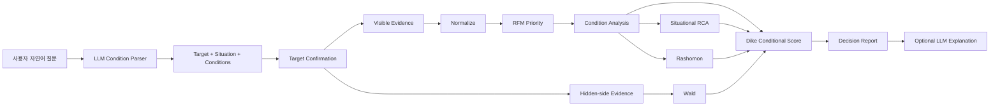

# ⚖️ Dike's Eye · Conditional Decision Agent

> **평균 평점이 아니라, 내 조건에서 선택해도 되는지 판단합니다.**

**Live App:** https://dikes-eye-poc.streamlit.app/

Dike's Eye는 리뷰를 요약하는 서비스가 아닙니다. 사용자가 자연어로 말한 **중요조건과 사용 상황**을 먼저 해석하고, 각 조건에 연결되는 Evidence를 따로 계산해 **조건부 의사결정**을 돕는 Agent입니다.

예를 들어:

```text
가격은 조금 비싸도 괜찮고, 아늑하고 분위기 좋은 곳이 중요해.
웨이팅은 싫어.
```

Dike는 이를 다음처럼 구조화합니다.

```text
가격·가성비     tolerate · 중요도 낮음
안락함·편안함   prefer   · 중요도 높음
분위기·소음     prefer   · 중요도 높음
웨이팅·예약     avoid    · 중요도 높음
```

그 다음 각 조건을 **독립적으로 분석**합니다.

```text
가격·가성비
- 관련 의견 31건
- 긍정 23건 / 부정 8건

안락함·편안함
- 관련 의견 14건
- 긍정 10건 / 부정 4건

분위기·소음
- 관련 의견 19건
- 긍정 12건 / 부정 7건
```

요일·시간·목적이 있다면 같은 조건이 그 상황에서 어떻게 달라지는지도 별도로 비교합니다.

---

## 1. 제품 정의

Dike's Eye의 핵심 질문은 하나입니다.

> **“사람들이 좋아하는가?”가 아니라 “내 조건에서는 선택해도 되는가?”**

이를 위해 세 가지 관점을 결합합니다.

### 🎭 Rashomon — 서로 다른 진실

같은 대상에서도 평가가 갈리는 Aspect를 찾습니다.

```text
분위기·소음
긍정 12건 / 부정 7건
```

평균으로 뭉개지 않고 **왜 의견이 나뉘는지**를 보여줍니다.

### 🕳️ Wald — 사라진 진실

일반 리뷰에 잘 남지 않는 이탈 Evidence를 별도로 찾습니다.

Restaurant:
- 예약 실패
- 웨이팅 포기
- 주차 포기
- 재방문 이탈

Product:
- 반품 / 환불
- 불량 / 고장
- 재판매 / 처분
- 후회 / 이탈

이 값은 실제 실패율이 아니라 **리뷰만 보면 놓칠 수 있는 위험 신호의 검색 건수**입니다.

### ⚖️ Dike — Conditional Decision

사용자가 말한 조건을 각각 계산하고 중요도까지 반영합니다.

```text
조건별 Fit
× 사용자 중요도
× Evidence 신뢰도
+ 전체 긍정/부정 균형
- 상황별 위험
- Wald 위험
= Dike Fit Score
```

---

## 2. LLM과 계산 엔진의 역할 분리

Dike's Eye는 LLM에게 최종 판단을 맡기지 않습니다.

### LLM이 하는 일

- 자연어 질문 해석
- 대상명 추출
- 중요조건 추출
- 조건 방향 해석
  - `prefer`
  - `avoid`
  - `tolerate`
- 중요도 추정
- 검색어 확장
- 최종 결과 자연어 설명

### Deterministic Engine이 하는 일

- Evidence 건수
- 긍정 / 부정 분류
- 조건별 비율
- RFM Priority
- Rashomon Conflict
- 상황별 negative-rate 차이
- Wald signal count
- Fit Score
- Confidence
- Verdict

즉:

```text
LLM = 조건 통역관
Analytics = Evidence 계산기
Dike Score = 판단 엔진
```

---

## 3. Conditional 구조

조건은 두 종류로 분리합니다.

### Preference Condition — 무엇이 중요한가?

예:

```text
가격
분위기
안락함
맛
서비스
웨이팅
주차
배터리
착용감
성능
```

각 조건은 Canonical Aspect로 정규화됩니다.

```text
가격/가성비/예산        → price_value
분위기/조용함/감성      → noise_atmosphere
안락함/편안함/아늑함    → comfort
웨이팅/예약              → wait_reservation
친절/응대                → service
맛/품질/성능             → quality_performance
배터리/충전              → battery
음질/화질                → audio_visual
주차/휴대성/착용감       → convenience_fit
디자인/마감              → design_experience
```

### Situational Condition — 언제/어떤 상황인가?

예:

```text
토요일
19:00
소개팅
출퇴근
업무
여행
```

이 값들은 조건 자체 평가를 대체하지 않습니다. 대신 **같은 조건이 내 상황에서 달라지는지**를 비교합니다.

```text
전체 분위기 부정률 32%
vs
토요일 19시 소개팅 Evidence 부정률 47%
→ +15%p
```

---

## 4. Evidence 원칙

중요한 원칙:

> **조건 전용 검색 결과가 적다고 해서 해당 조건 Evidence가 없는 것은 아닙니다.**

예를 들어 `가격`을 중요조건으로 말했고 전체 Evidence에서 가격·가성비 관련 의견이 31건 잡혔다면, 그 31건이 가격 조건의 기본 Evidence입니다.

```text
가격·가성비 전체 Evidence = 31건
가격 전용 검색 Evidence = 12건
```

12건은 Coverage를 높이는 추가 근거일 뿐, 가격 조건 존재 여부를 결정하지 않습니다.

이 원칙은 가격뿐 아니라 **안락함, 분위기, 웨이팅, 서비스, 배터리 등 모든 조건에 동일하게 적용**됩니다.

---

## 5. 전체 아키텍처



---

## 6. Runtime Pipeline

```text
Natural Language Question
        ↓
LLM Condition Parser
- target
- kind
- day/time/purpose
- conditions[]
  - raw
  - aspect
  - direction
  - importance
        ↓
Target Confirmation
        ↓
NAVER Evidence Collection
├─ general reviews
├─ positive / negative views
├─ condition queries
└─ hidden-side queries
        ↓
Normalize
- aspect
- sentiment
- recency
- condition_direct_aspects
- situational_aligned
        ↓
RFM
R = Recency
F = Frequency / Source Diversity
M = User Match
        ↓
Condition Analysis
- 전체 조건 Evidence
- 긍정/부정 건수
- direct coverage
- condition fit
        ↓
Situational RCA
- 전체 조건 negative-rate
vs
- 내 상황 subset negative-rate
        ↓
Rashomon + Wald
        ↓
Dike Conditional Score
        ↓
Decision Report
```

---

## 7. Scoring

현재 정책: `conditional-v4`

개념적으로:

```text
50 Neutral
+ 전체 Evidence sentiment
+ 조건별 weighted fit
+ 반복 긍정 strength
- 내 상황에서 증가한 risk
- Wald risk
        ↓
Confidence 기반 shrink
        ↓
Fit Score / Verdict
```

조건별 Fit은 다음 요소를 반영합니다.

```text
Condition Fit
× Importance
× Evidence Confidence
```

`tolerate` 조건은 가중치를 낮게 적용합니다.

예:

```text
"가격은 좀 비싸도 괜찮아"
→ price_value
→ tolerate
→ importance 낮음
```

반대로:

```text
"웨이팅은 정말 싫어"
→ wait_reservation
→ avoid
→ importance 높음
```

---

## 8. 현재 UI 목표

사용자는 분석 용어보다 먼저 자신의 조건이 제대로 반영됐는지 확인해야 합니다.

```text
Dike's Conditional View
조건부 추천 · 68/100

이번 판단 조건
[가격 · 어느 정도 허용]
[안락함 · 중요]
[분위기 · 중요]
[웨이팅 · 회피]

내가 중요하게 본 조건별 판단

가격·가성비
긍정 23 / 31건
조건 적합 74/100

안락함·편안함
긍정 10 / 14건
조건 적합 71/100

분위기·소음
긍정 12 / 19건
조건 적합 63/100
```

---

## 9. 프로젝트 구조

```text
dikes-eye-poc/
├─ streamlit_app.py
├─ requirements.txt
├─ README.md
├─ docs/
│  ├─ ARCHITECTURE.md
│  └─ DECISION_REPORT.md
└─ src/
   ├─ condition_taxonomy.py   # Canonical Condition 정의
   ├─ condition_analysis.py   # 조건별 deterministic 분석
   ├─ intent.py               # LLM + fallback Condition Parser
   ├─ naver_client.py         # NAVER Evidence 수집
   ├─ normalize.py            # Evidence 정규화
   ├─ eda.py
   ├─ rfm.py
   ├─ rashomon.py
   ├─ rca.py                  # Situational RCA
   ├─ wald.py
   ├─ scoring.py              # conditional-v4
   ├─ reporting.py
   └─ llm_explain.py
```

---

## 10. 실행

Python 3.12 권장.

```bash
python -m venv .venv
source .venv/bin/activate
pip install -r requirements.txt
streamlit run streamlit_app.py
```

`.streamlit/secrets.toml`

```toml
NAVER_API_HUB_CLIENT_ID = "..."
NAVER_API_HUB_CLIENT_SECRET = "..."

OPENAI_API_KEY = "..."
OPENAI_MODEL = "gpt-5-mini"
```

OpenAI Key가 없으면 규칙 기반 fallback parser로 동작하며, 핵심 Evidence 계산과 점수는 계속 사용할 수 있습니다.

---

## 핵심 원칙

Dike's Eye는 다음을 말하지 않습니다.

```text
이 식당에 가면 75% 만족한다.
이 제품의 반품률은 12%다.
주말 방문이 불만의 원인이다.
```

대신 다음을 말합니다.

```text
당신이 중요하게 본 분위기 관련 의견은 19건이고, 긍정 12건 / 부정 7건입니다.
토요일 저녁 관련 Evidence에서는 같은 분위기 항목의 부정 비율이 전체보다 15%p 높았습니다.
예약 실패 신호는 4건 검색됐지만, 이는 실제 예약 실패율을 뜻하지 않습니다.
```

**Dike's Eye의 목적은 미래를 단정하는 것이 아니라, 사용자의 조건에 따라 Evidence를 다시 정렬해 선택을 돕는 것입니다.**
