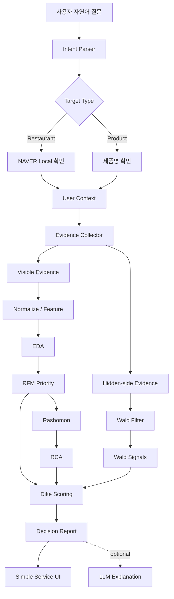
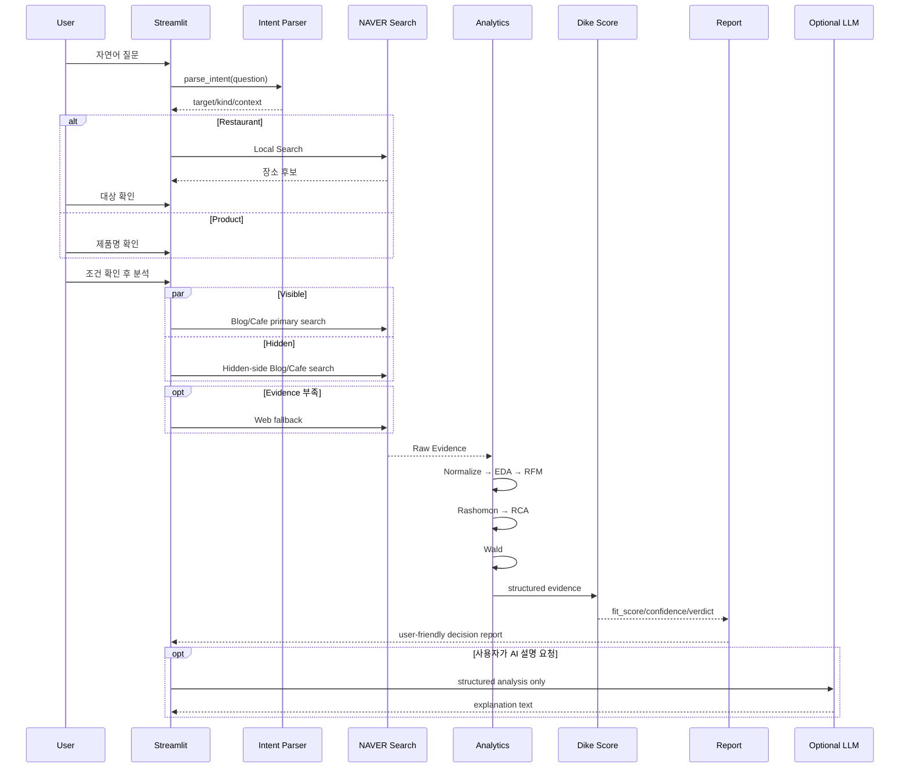

# Dike's Eye Architecture

## 1. Product view

Dike's Eye는 리뷰 요약기가 아니라 **선택 직전의 의사결정 Agent**입니다.



---

## 2. Why two Evidence channels?

### Visible Evidence

일반 리뷰·후기처럼 이미 선택한 사용자의 경험을 중심으로 수집합니다.

목적:

- 무엇을 좋아했는가
- 무엇을 싫어했는가
- 어떤 Aspect에서 의견이 갈리는가
- 사용자의 조건과 직접 맞는 Evidence는 무엇인가

### Hidden-side Evidence

일반 만족 리뷰에 덜 남을 수 있는 행동을 별도 검색합니다.

Restaurant:

- 예약 실패
- 웨이팅 포기
- 주차 포기
- 재방문 이탈

Product:

- 반품 / 환불
- 불량 / 고장
- 재판매 / 처분
- 후회 / 재구매 이탈

이 채널을 분리하는 이유는 일반 리뷰와 이탈 Evidence를 하나의 감성점수로 섞으면 의미가 사라지기 때문입니다.

---

## 3. Runtime pipeline



---

## 4. Deterministic decision boundary

LLM이 판단을 직접 생성하게 두지 않습니다.

```text
Evidence
   ↓
Features
   ↓
RFM Priority
   ↓
Conflict / RCA / Wald
   ↓
Deterministic Score
   ↓
Verdict
   ↓
Report
   ↓
Optional LLM Explanation
```

LLM이 할 수 있는 것:

- 이미 확정된 결과를 자연어로 설명
- 구조화된 근거를 읽기 쉽게 표현

LLM이 할 수 없는 것:

- fit score 재계산
- verdict 변경
- confidence 변경
- 근거에 없는 인과관계 생성

---

## 5. Evidence priority

Dike's Eye에서 RFM은 마케팅 RFM을 그대로 쓰는 것이 아니라 **Evidence 우선순위**로 재정의합니다.

```text
R = Recency
    최근 게시된 Evidence인가?

F = Frequency
    동일 Aspect가 반복되고 여러 Source에서 나타나는가?

M = Match
    사용자가 말한 목적·조건과 직접 연결되는가?
```

```text
Priority = 0.35R + 0.25F + 0.40M
```

M의 비중을 가장 높게 둔 이유는 이 서비스가 전체 평균보다 **사용자별 의사결정**을 목적으로 하기 때문입니다.

---

## 6. Rashomon + RCA

### Rashomon

Aspect 단위로 긍정과 부정 Evidence가 동시에 충분히 존재할 때 Conflict로 판단합니다.

```text
Aspect
├─ Positive Evidence
└─ Negative Evidence
        ↓
Opinion Conflict
```

### RCA

Conflict가 발견되면 본문에 명시된 Context를 기준으로 negative-rate 차이를 비교합니다.

```text
전체 Aspect Negative Rate
vs
특정 Context Negative Rate
        ↓
Lift
```

출력:

- aspect
- context
- effect: worsens / improves
- baseline negative rate
- context negative rate
- lift
- supporting evidence
- counter evidence
- confidence
- user_aligned
- claim_level = observed_association

중요: 이 결과는 **원인 확정이 아니라 관찰된 연관성**입니다.

---

## 7. Wald

Wald는 일반 리뷰만 보면 빠질 수 있는 Evidence를 찾습니다.

```text
Visible Reviews
      ↓
선택한/사용한 사람 중심

Hidden-side Search
      ↓
포기 / 실패 / 반품 / 이탈
```

Wald의 `signal_score`는 실제 발생률이 아닙니다.

```text
Signal Strength
= 반복된 hidden-side keyword
+ source diversity
```

즉 “반품률 20%”라고 말하지 않고,

> “반품·환불과 관련된 이탈 신호가 여러 Evidence에서 확인된다.”

라고 표현합니다.

---

## 8. Dike scoring

개념적 구조:

```text
50 Neutral Base
 + overall weighted sentiment
 + context-matched sentiment
 - user-aligned RCA risk
 - Wald risk
        ↓
Raw Fit
        ↓
Confidence 기반 Neutral Shrink
        ↓
Evidence / Risk Score Caps
        ↓
Fit Score + Verdict
```

Evidence가 부족하면 50점 방향으로 돌아갑니다.

따라서 Dike's Eye에서 높은 점수는 단순 긍정리뷰가 많다는 뜻이 아니라:

1. Evidence가 충분하고
2. Source가 어느 정도 다양하고
3. 최근 Evidence가 존재하고
4. 사용자의 조건과 맞고
5. 사용자 조건에 정렬된 위험이 낮고
6. Hidden-side severe signal이 낮다는 뜻입니다.

---

## 9. API efficiency

### Before

```text
Visible 4 queries × 3 endpoints = 12
Hidden  6 queries × 3 endpoints = 18
----------------------------------
최대 약 30 calls / target
```

### Current

```text
Visible 2 queries × Blog/Cafe = 4
Hidden  2 queries × Blog/Cafe = 4
---------------------------------
기본 8 calls / target
```

Evidence가 부족할 때만 Web 검색을 fallback으로 사용합니다.

추가 전략:

- ThreadPoolExecutor 병렬 호출
- LRU cache
- URL/title dedupe
- 최대 Evidence 제한
- restaurant / product query plan 분리

---

## 10. Extension points

다음 도메인으로 확장할 때 바뀌는 부분은 주로 세 군데입니다.

```text
Intent Rules
Evidence Query Plan
Aspect / Wald Rules
```

공통으로 재사용되는 부분:

```text
Normalize
EDA
RFM
Rashomon
RCA
Scoring
Reporting
LLM Explanation
```

따라서 Hotel, Travel, SaaS, Education 등으로 확장할 때 전체 Agent를 다시 만들 필요가 없습니다.
