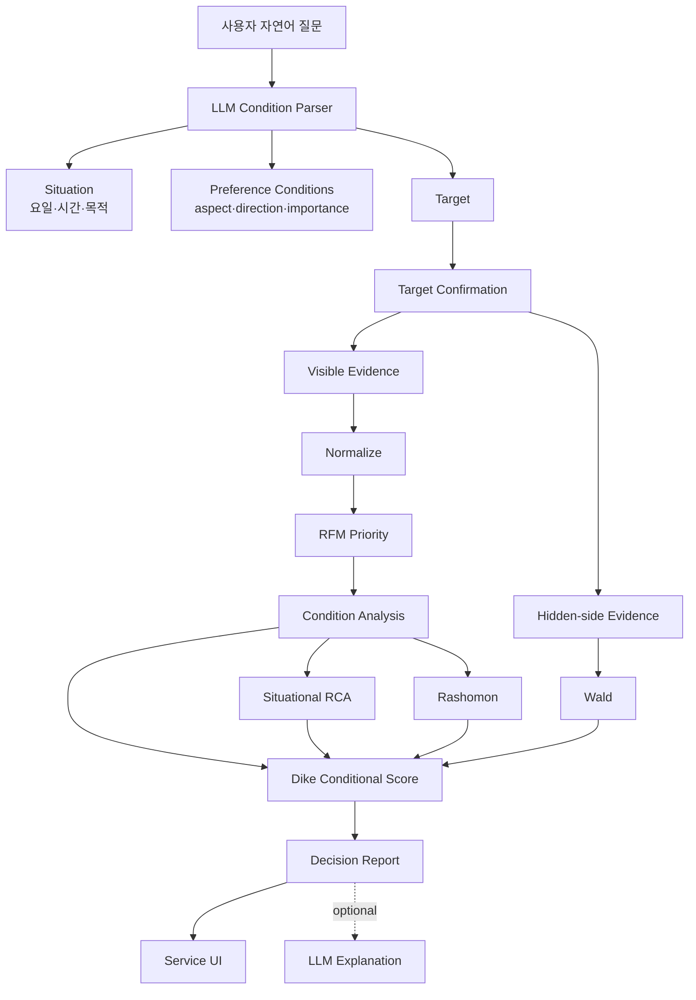
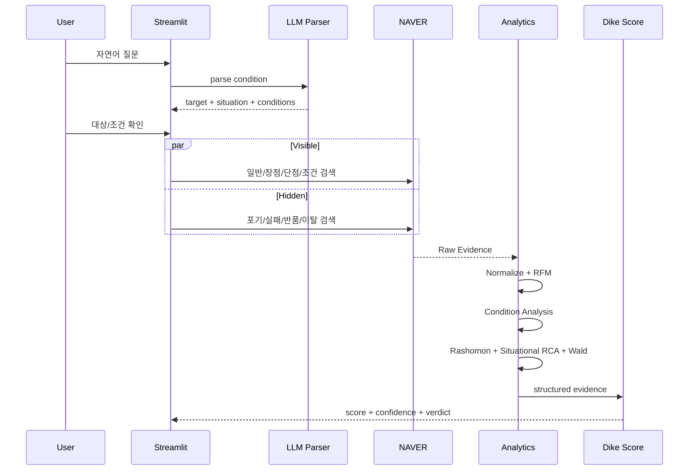

# Dike's Eye Architecture

## Product view

Dike's Eye는 리뷰 요약기가 아니라 **Conditional Decision Agent**입니다.

핵심 질문:

> **“평균적으로 좋은가?”가 아니라 “내 조건에서 선택해도 되는가?”**



## LLM boundary

LLM은 **의미 해석**만 담당합니다.

```text
자연어
"가격은 조금 비싸도 괜찮고 분위기는 중요해"
        ↓
LLM
price_value / tolerate / 0.35
noise_atmosphere / prefer / 0.90
```

LLM이 하지 않는 것:

- Evidence 건수 계산
- 긍정/부정 비율 계산
- RCA lift 계산
- Wald score 계산
- Fit Score 계산
- Verdict 변경

이 값들은 전부 deterministic engine이 계산합니다.

## Condition model

### Preference Condition

사용자가 중요하게 보는 축입니다.

```text
raw
aspect
label
direction = prefer | avoid | tolerate
importance = 0.1 ~ 1.0
search_terms[]
```

Canonical Aspect 예시:

```text
price_value
noise_atmosphere
comfort
wait_reservation
service
quality_performance
battery
audio_visual
convenience_fit
design_experience
```

### Situational Condition

사용 상황입니다.

```text
date_or_day
time
purpose
```

상황조건은 조건 자체 평가를 대체하지 않고 **같은 조건이 특정 상황에서 달라지는지**를 비교하는 데 사용합니다.

## Evidence model

조건 Evidence는 두 층입니다.

```text
1. Aspect Evidence
   해당 조건과 연결되는 전체 Evidence

2. Direct Coverage
   조건 전용 검색 또는 조건 표현이 직접 포함된 Evidence
```

예:

```text
가격·가성비 전체 Evidence 31건
가격 전용 검색/직접 표현 12건
```

가격 조건 평가는 31건으로 계산합니다. 12건은 coverage 보강용입니다.

이 규칙은 모든 조건에 동일하게 적용됩니다.

## Runtime sequence



## Condition Analysis

각 중요조건별로:

```text
total_count
positive_count
negative_count
positive_rate
negative_rate
direct_count
fit
evidence_confidence
```

상황 Evidence가 충분하면 추가로:

```text
situational_count
situational_negative_rate
situational_lift
```

## Rashomon

같은 Aspect에서 긍정/부정이 충분히 공존하면 Conflict로 봅니다.

Rashomon은 감점 그 자체가 아니라 **의견이 갈리는 영역을 찾는 장치**입니다.

## Situational RCA

```text
전체 조건 Negative Rate
vs
사용 상황 subset Negative Rate
        ↓
Lift
```

이 값은 `observed_association`이며 인과관계를 의미하지 않습니다.

## Wald

Visible 리뷰에 잘 남지 않는 신호를 별도로 수집합니다.

Restaurant:
- 예약 실패
- 웨이팅 포기
- 주차 포기

Product:
- 반품/환불
- 불량/고장
- 재판매/후회

Wald는 실제 실패율이 아니라 **hidden-side signal strength**입니다.

## Scoring v4

```text
50 Neutral
+ overall sentiment
+ condition weighted fit
+ repeated positive strength
- situational risk
- Wald risk
        ↓
confidence shrink
        ↓
score / verdict
```

Condition contribution:

```text
Condition Fit
× Importance
× Evidence Confidence
```

`tolerate`는 의도적으로 낮은 비중으로 반영합니다.

## Extension

새로운 도메인 확장 시 우선 변경되는 부분:

```text
condition_taxonomy.py
NAVER query plan
Wald signal rules
```

공통 재사용:

```text
LLM condition parsing
Normalize
RFM
Condition Analysis
Rashomon
Situational RCA
Scoring
Reporting
```
