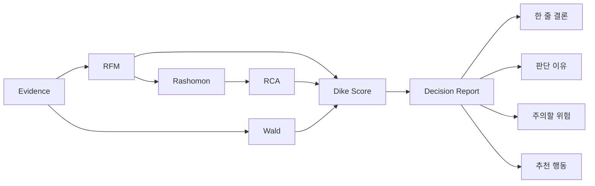

# Dike's Eye Decision Report

## 1. 보고서 목적

사용자는 EDA, RFM, RCA, Wald라는 용어를 이해할 필요가 없습니다.

Dike's Eye의 사용자 보고서는 아래 다섯 질문에 답하도록 설계합니다.

1. **결론이 무엇인가?**
2. **왜 그렇게 판단했는가?**
3. **나에게 어떤 조건이 유리하거나 불리한가?**
4. **리뷰만 보면 놓칠 수 있는 위험은 무엇인가?**
5. **그래서 나는 무엇을 확인하고 결정하면 되는가?**

---

## 2. 화면 구조

```text
[한 줄 결론]
🟡 조건부 추천 · 64/100
토요일 · 19:00 · 소개팅 기준

[판단 신뢰도]
71%

[왜 이렇게 판단했나요?]
- 분위기·소음 평가는 사람과 시간대에 따라 갈립니다.
- 저녁 Context에서 부정적 평가가 기준보다 더 자주 관찰됩니다.

[무엇을 조심해야 하나요?]
- 예약 실패·웨이팅 포기 신호가 일반 방문 리뷰 밖에서 일부 검색됩니다.

[그래서 어떻게 결정하면 되나요?]
- 예약을 먼저 확보하세요.
- 대화가 중요한 일정이라면 혼잡 시간대 후기와 좌석 간격을 먼저 확인하세요.

[상세 근거]
Rashomon / RCA / Wald / RFM
```

---

## 3. 식당 예시

### 입력

```text
토요일 7시 소개팅인데 성수 OO다이닝 어때?
```

### 사용자 보고서

> ## 🟡 조건부 추천 · 63/100 — 토요일 · 19:00 · 소개팅 기준
>
> **OO다이닝은 무조건 추천하기보다 예약과 혼잡 조건을 확인하고 선택해야 하는 곳입니다.**
>
> 판단 신뢰도 69%

#### 왜 이렇게 판단했나요?

- 음식과 분위기에 대한 긍정 평가는 많지만, **소음·혼잡 평가는 서로 크게 갈립니다.**
- 특히 저녁 관련 Evidence에서 분위기·소음의 부정적 평가가 전체 기준보다 더 자주 관찰됩니다.
- 사용자가 말한 ‘소개팅’은 대화 가능성과 좌석 분위기의 중요도가 높기 때문에 이 차이를 평균 별점보다 크게 반영했습니다.

#### 무엇을 조심해야 하나요?

- 일반 방문 리뷰 외 검색에서 **예약 실패·웨이팅 포기** 신호가 일부 확인됩니다.
- 이 값은 실제 예약 실패율이 아니라, 방문 리뷰만 볼 때 빠질 수 있는 이탈 Evidence입니다.

#### 그래서 어떻게 결정하면 되나요?

- **예약이 확보되어 있다면 선택 가능성이 높아집니다.**
- 대화가 중요한 일정이라면 주말 저녁 혼잡도와 좌석 간격 후기를 한 번 더 확인하세요.
- 예약이 어렵거나 대기시간이 길다면 같은 지역의 대체 식당도 함께 비교하는 편이 안전합니다.

---

## 4. 상품 예시

### 입력

```text
출퇴근용으로 OO 헤드폰 사도 될까? 배터리랑 착용감이 중요해
```

### 사용자 보고서

> ## 🟡 조건부 추천 · 66/100 — 출퇴근 · 배터리 · 착용감 기준
>
> **기본 성능은 괜찮지만 장시간 착용과 배터리 체감에서 사용자별 차이가 있어 조건 확인이 필요한 제품입니다.**
>
> 판단 신뢰도 73%

#### 왜 이렇게 판단했나요?

- 음질·노이즈캔슬링은 대체로 긍정적이지만 **착용감 평가는 크게 갈립니다.**
- 출퇴근·장시간 사용 관련 Evidence에서 무게와 착용압에 대한 부정 의견이 반복됩니다.
- 사용자의 핵심 조건이 ‘착용감’이기 때문에 전체 평균 만족도보다 해당 Evidence에 더 높은 가중치를 줬습니다.

#### 무엇을 조심해야 하나요?

- 일반 리뷰 밖 검색에서 **반품·교환, 연결 문제** 신호가 일부 확인됩니다.
- 이는 실제 제품 불량률이나 반품률이 아니라 놓치기 쉬운 이탈 신호입니다.

#### 그래서 어떻게 결정하면 되나요?

- **가능하면 30분 이상 실제 착용해 본 뒤 구매하는 것이 좋습니다.**
- 출퇴근 하루 사용시간 기준의 배터리 후기를 우선 확인하세요.
- 가격 차이가 크지 않다면 착용감이 더 안정적인 대체 모델과 비교하는 것이 좋습니다.

---

## 5. 설득력 있게 보여주는 원칙

### 5.1 숫자보다 해석을 먼저 보여준다

나쁜 방식:

```text
RCA Risk = 0.37
Wald Risk = 0.42
M = 0.25
```

좋은 방식:

```text
저녁 시간대에서 소음 관련 부정 평가가 기준보다 더 자주 관찰됩니다.
예약 실패와 웨이팅 포기 신호도 일부 확인됩니다.
```

기술 수치는 상세 근거에만 둡니다.

### 5.2 평균보다 사용자의 조건을 먼저 말한다

```text
전체 리뷰는 좋습니다.
```

보다

```text
전체 평가는 좋은 편이지만, 토요일 저녁 소개팅이라는 조건에서는 소음과 웨이팅이 더 중요합니다.
```

이 Dike's Eye의 핵심 메시지입니다.

### 5.3 위험을 과장하지 않는다

RCA:

```text
주말이 불만의 원인입니다.  X
주말 관련 Evidence에서 부정 평가가 더 자주 관찰됩니다.  O
```

Wald:

```text
예약 실패율이 높습니다.  X
예약 실패·웨이팅 포기 신호가 일반 방문 리뷰 밖에서도 검색됩니다.  O
```

### 5.4 마지막에는 행동으로 끝낸다

사용자가 원하는 것은 분석이 아니라 결정입니다.

따라서 보고서 마지막 문장은 다음 중 하나여야 합니다.

```text
→ 예약을 확보하고 선택하세요.
→ 장시간 착용 후 구매하세요.
→ 같은 가격대 대체 제품을 먼저 비교하세요.
→ 현재 조건에서는 선택해도 됩니다.
```

---

## 6. Decision Report와 내부 분석의 연결



사용자에게는 오른쪽 네 항목을 먼저 보여주고, 왼쪽 분석 파이프라인은 필요할 때만 펼쳐서 확인하도록 합니다.
