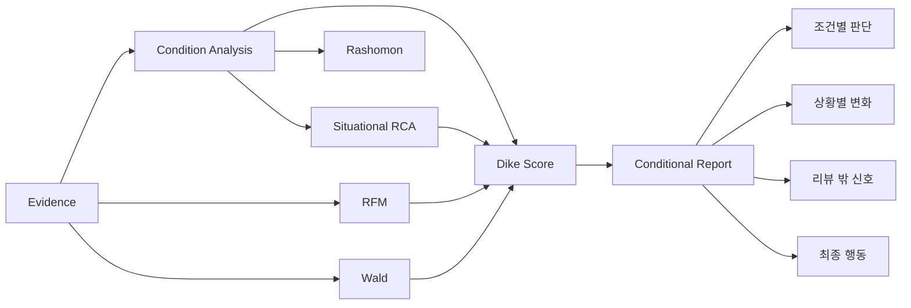

# Dike's Eye Conditional Decision Report

## 목적

사용자는 EDA, RFM, RCA라는 용어보다 먼저 다음을 알고 싶습니다.

1. **내 조건을 제대로 이해했는가?**
2. **각 조건은 실제 Evidence에서 어떤 평가를 받는가?**
3. **내 사용 상황에서 그 평가가 달라지는가?**
4. **그래서 선택해도 되는가?**

따라서 보고서의 중심은 기술 지표가 아니라 **조건별 판단**입니다.

---

## 메인 화면 구조

```text
Dike's Conditional View
조건부 추천 · 68/100
신뢰도 72%

이번 판단 조건
[가격 · 어느 정도 허용]
[안락함 · 중요]
[분위기 · 중요]
[웨이팅 · 회피]

내가 중요하게 본 조건별 판단

가격·가성비
관련 의견 31건
긍정 23건 / 부정 8건
조건 적합 74/100
직접 검색/표현 근거 12건

안락함·편안함
관련 의견 14건
긍정 10건 / 부정 4건
조건 적합 71/100

분위기·소음
관련 의견 19건
긍정 12건 / 부정 7건
토요일 19시 소개팅에서는 부정률 +15%p

웨이팅·예약
회피 조건
관련 의견 17건
부정 9건
→ 사용자의 회피 요구와 충돌 가능

의견이 갈린 부분
Rashomon

리뷰 밖 신호
Wald

Dike의 최종 제안
```

---

## 조건 Evidence 표시 원칙

### 전체 Aspect Evidence가 기본

사용자가 `가격`을 중요하다고 말했다면 `가격·가성비`로 분류된 전체 Evidence가 가격 조건의 기본 근거입니다.

```text
가격 관련 전체 Evidence 31건
긍정 23건
부정 8건
```

### Direct Evidence는 Coverage

```text
가격 전용 검색/직접 표현 12건
```

12건은 조건의 존재 여부를 결정하지 않습니다. **추가적인 직접 근거 범위**를 의미합니다.

따라서 다음 표현은 금지합니다.

```text
가격 전용 검색이 2건이므로 가격 Evidence가 없다.  X
```

다음처럼 표현합니다.

```text
가격 관련 의견은 전체 31건 확보됐고,
그중 가격을 직접 검색하거나 명시한 근거는 12건입니다.  O
```

이 규칙은 모든 조건에 동일합니다.

---

## 상황별 변화 표시

요일·시간·목적은 중요조건과 별도입니다.

예:

```text
분위기·소음 전체
부정 7 / 19건 = 37%

토요일 19시 소개팅 Evidence
부정 5 / 9건 = 56%

차이
+19%p
```

사용자에게는:

> 분위기 자체는 긍정 의견이 더 많지만, 토요일 저녁 소개팅과 맞는 9건에서는 부정 비율이 전체보다 19%p 높았습니다.

라고 설명합니다.

인과관계로 표현하지 않습니다.

---

## 조건 방향

LLM parser가 자연어 뉘앙스를 세 방향으로 구조화합니다.

### prefer

```text
"분위기가 중요해"
"아늑했으면 좋겠어"
```

좋은 평가가 많을수록 조건 적합도가 올라갑니다.

### avoid

```text
"웨이팅은 싫어"
"발열은 피하고 싶어"
```

해당 문제를 지적하는 부정 Evidence가 많을수록 조건 적합도가 내려갑니다.

### tolerate

```text
"조금 비싸도 괜찮아"
"무게는 어느 정도 감수할 수 있어"
```

중요도와 점수 반영량을 낮춥니다.

---

## 식당 예시

### 입력

```text
토요일 7시 소개팅인데 OO다이닝 어때?
가격은 조금 비싸도 괜찮고, 분위기와 안락함이 중요해.
웨이팅은 싫어.
```

### 조건 해석

```text
토요일 / 19:00 / 소개팅

가격·가성비     tolerate · 35%
분위기·소음     prefer   · 90%
안락함·편안함   prefer   · 90%
웨이팅·예약     avoid    · 90%
```

### 사용자 보고서

```text
조건부 추천 · 68/100

분위기·소음
긍정 12 / 19건
토요일 저녁 subset에서는 부정률 +15%p

안락함·편안함
긍정 10 / 14건

웨이팅·예약
부정 9 / 17건
회피 조건과 충돌

가격·가성비
긍정 23 / 31건
다만 사용자가 '비싸도 괜찮다'고 했기 때문에 낮은 가중치로 반영
```

---

## 상품 예시

### 입력

```text
출퇴근용으로 OO 헤드폰 살까?
음질은 중요하고 배터리는 오래가야 해.
무게는 조금 무거워도 괜찮아.
```

### 조건 해석

```text
음질·화질       prefer   · 높음
배터리·충전     prefer   · 높음
편의성·적합성   tolerate · 낮음
```

각 조건의 전체 Evidence를 계산하고 출퇴근 상황 subset이 충분할 때만 추가 변화를 보여줍니다.

---

## Wald 표시

Wald는 별도 카드로 유지합니다.

```text
예약 실패 4건
웨이팅 포기 3건
```

이는 실제 발생률이 아니라 **검색된 hidden-side signal 건수**입니다.

---

## 리포트 문체

권장:

> 분위기 관련 의견 19건 중 긍정 12건, 부정 7건이었습니다. 전체적으로는 긍정이 우세하지만 토요일 저녁 소개팅과 맞는 Evidence에서는 부정 비율이 15%p 높았습니다.

지양:

> 현재 확보된 Evidence를 종합적으로 검토한 결과 분위기와 관련된 부정적 위험 요인이 유의미하게 관찰됩니다.

원칙은 **숫자 → 의미 → 행동**입니다.

---

## 사용자 화면과 내부 분석 연결



사용자가 가장 먼저 보는 것은 **조건별 판단**이고, 기술 지표는 상세보기로 둡니다.
